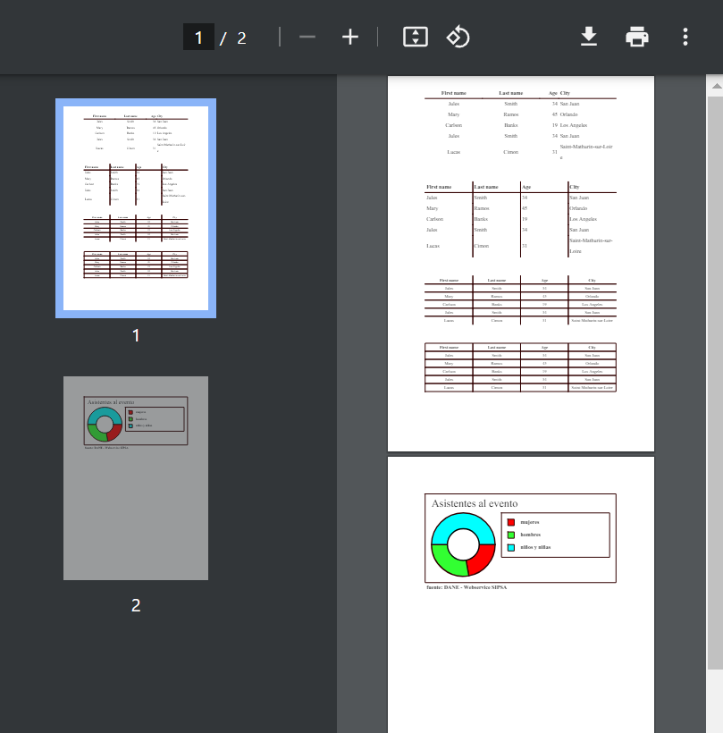

---

# Python Software Architecture

***

Esta es una propuesta de arquitectura de software en python, donde se facilita la actualización automática de dependencias que no se encuentren en gestores de paquetes de python, sino en repositorios remotos.

El software clonará las versiones mas actualizadas de los repositorios establecidos como dependencias.

>"./project/projectConfig/projectConfig.py"  

y los reinstalará automaticamente en:

> ./project/dependencies

Esto lo hará antes de la ejecución del proyecto, en caso tal que no se encuentre incluido aun, para prevenir que se rompa.


## Estructura y lógica de funcionamiento:

> A continuación se estable la estructura de directorios del proyecto.

| Descripción                       | comando                             |
| :----                             | :---                                |
| ./enterprise                      | Facilita el uso de repositorios externos como dependencias.|
| ./enterprise/enterpriseDeployment | Está para establecer repositorios externos como dependencias.|
| ./enterprise/enterpriceDependecies | Garantiza que las dependencias esten presentes. |
| ./enterprise/enterpriseCore | Indexa dependencias por herencia en una sola clase. |
| ./project | Escenario de trabajo del desarrollador. |
| ./project/data | Está para trabajar en el acceso y tranformación de data. |
| ./project/projectConfig | Está para configurar la clonación automántica de las dependencias a ser utilizadas en el projecto. |
| ./project/dependencies | Está para almacenar y llevar un control transparente de las dependencias de software externos usados en el proyecto, en especial, se agradece que sea software libre debidamente licenciado. |
| ./project/extract | Está para configurar procesos de extracción de data. |
| ./project/reports | Está para almacenar los reportes generados en PDF. |

## Ejemplo de uso:
> En esta demo se ejecutaron exitosamente los códigos
de repositorios externos, sin la necesidad de alterar su código, por decirlo de alguna manera, fueron usados como librerías:
<ul>
<li>cliente-webservice-sipsa</li>
<li>python-fpdf2-table</li>
<li>python-fpdf2-pie-chart</li>
</ul>



---

## Documentación técnica

***

### Configuración del entorno de desarrollo.
| Paso   | Descripción                       | comando                             |
| :----  | :----                             | :---                                |
| Paso 1 |  Crear el entorno de trabajo.     | python -m venv env                  |
| Paso 2 | Activar el entorno de trabajo.    | ./env/Scripts/activate              |
| Paso 3 | Actualizar el gestor de paquetes. | python -m pip install --upgrade pip |
| Paso 4 | Prepare la receta de librerías.   | pip install -r requirements.txt     |

***

### Librerías del proyecto.
| librería  | Descripción              | Comando                           |
| :----     | :---                     | :---                              |
| fpdf2      | Permite la creación de PDFs | python -m pip install fpdf2       |
| GitPython  | Facilita la clonación de repositorios externos  | python -m pip install GitPython       |
| zeep      | Permite el acceso a SOAP | python -m pip install zeep        |
| xmltodict | hace que trabajar con XML se sienta como si estuviera trabajando con JSON , | python -m pip install xmltodict   |

> Con la instalación de la librería fpdf2 se instalarán las
siguientes librerías de manera automática:
<ul>
<li>defusedxml==0.7.1</li>
<li>fonttools==4.51.0</li>
<li>fpdf2==2.7.8</li>
<li>pillow==10.3.0</li>
</ul>

> Con la instalación de la librería GitPython se instalarán las siguientes librerías de manera automática:
<ul>
<li>gitdb==4.0.11</li>
<li>GitPython==3.1.43</li>
<li>smmap==5.0.1</li>
</ul>

> Con la instalación de la librería zeep se instalarán las siguientes librerías de manera automática:
<ul>
<li>attrs==23.2.0</li>
<li>certifi==2024.2.2</li>
<li>charset-normalizer==3.3.2</li>
<li>idna==3.6</li>
<li>isodate==0.6.1</li>
<li>lxml==5.2.1</li>
<li>platformdirs==4.2.0</li>
<li>pytz==2024.1</li>
<li>requests==2.31.0</li>
<li>requests-file==2.0.0</li>
<li>requests-toolbelt==1.0.0</li>
<li>six==1.16.0</li>
<li>urllib3==2.2.1</li>
<li>zeep==4.2.1</li>
</ul>

---

### Realice sus pruebas, actualizaciones o modificaciones.
> Puedes actualizar, contribuir y mejorar el presente software, es libre. Licencia GNU v3.  
No esta permitido modificar la licencia de trabajos derivados de este proyecto.  
Por norma internacional debes conservar el mismo tipo de licencia.

#### Actualizar la receta.

> Si agregas nuevas librerías al proyecto, no olvides actualizar la receta.

``` CMD
pip freeze > requirements.txt
```

---

#### Comprobar que todo está en orden.
| Paso   | Descripción                                   | comando                               |
| :----  | :----                                         | :---                                  |
| Paso 1 | Desactive el entorno de trabajo.              | deactivate                            |
| Paso 2 | Elimine el entorno anterior.                  | rm -R env                             |
| Paso 3 | Cree un entorno de python.                    | python -m venv env                    |
| Paso 4 | Active el entorno de trabajo.                 | ./env/Scripts/activate                |
| Paso 5 | Actualice el gestor de paquetes.              | python -m pip install --upgrade pip   |
| Paso 6 | Instale las librerías necesarias para operar. | pip install -r requirements.txt       |
| Paso 7 | Realice pruebas de rutina.                    |  |
| Paso 8 | Finalice su gestión.                          | deactivate                            |
